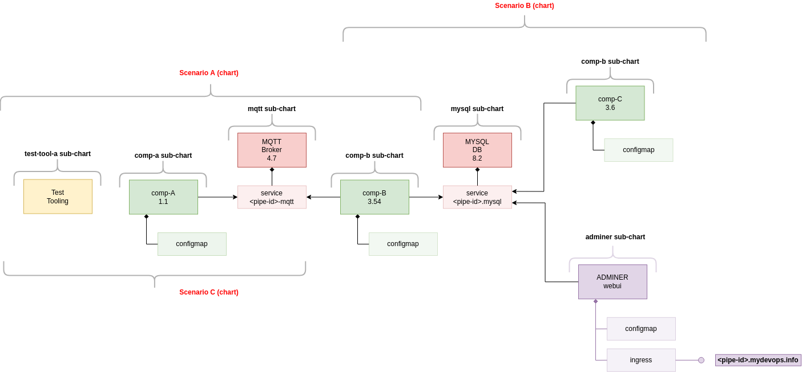

# task_and_docs

This simple devops and k8s showcase sketches a quite common software development scenario. Basically some self developed components (`comp-a`, `comp-a` and `comp-c`) are build, tested and deployed into a k8s cluster.



## How to deploy

### Manually

Either deploy the entire system via a umbrella/parent-chart:

```sh
helm repo add xo-sample https://artifactory.mydevops.info/artifactory/helm-xo-sample
helm repo update

helm install -n xo-sample adminer xo-sample/xo-sample
```

.. or deploy each part of the system separately:

```sh
#First add the helm repositories
helm repo add xo-sample https://artifactory.int.idevops.de/artifactory/helm-xo-sample
helm repo add k8s-at-home https://k8s-at-home.com/charts/
helm repo update

#Now just install the basic components
helm install -n xo-sample mosquitto k8s-at-home/mosquitto
helm install -n xo-sample mysql xo-sample/mysql
helm install -n xo-sample adminer xo-sample/adminer

#Install
helm install -n xo-sample comp-a xo-sample/comp-a
helm install -n xo-sample comp-b xo-sample/comp-b
helm install -n xo-sample comp-c xo-sample/comp-c
```

### FluxCD

Check the following project: https://code.siemens.com/xo/xo-devops-enablement/playground/sample-apps/xo-sample/environment/aws-account-fake

### Customization

While it is always possible to simply check-out the helm chart via git, default values can also be manipulated during deployment based on helm repositories.

Manipulate single values:

```sh
# First check available parameters via or read the manual:
helm show values xo-sample/comp-b

# Parameters can easily be set via:
helm upgrade/install --set image.tag=0.1.0 comp-b xo-sample/comp-b

# Alternative a local myvalues.yaml can be created and used during the deploy
helm show values xo-sample/comp-b > myvalues.yaml
# now manipulate the values to change ..
helm upgrade/install -f myvalues.yaml comp-b xo-sample/comp-b
```

## K8s Configuration

TODO
