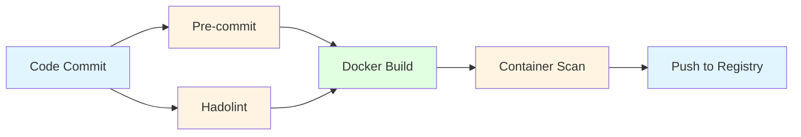

# Solution Strategy

## Phase I: Containerization Foundation

The first phase of the DevOps transformation focuses primarily on **containerization** as the foundational pillar. This strategic choice prioritizes internal team development and establishes a solid technical foundation before introducing more complex collaborative workflows or tools.

### Strategic Focus

Containerization serves as the initial cornerstone for several key reasons:

- **Achievable Entry Point**: Containerization provides a relatively straightforward starting point for teams transitioning from traditional deployment models, reducing the risk of overwhelming developers with too many simultaneous changes.

- **Microservices Alignment**: Container adoption naturally aligns with the migration toward a microservices architecture, establishing the mindset that services should be independently deployable and scalable (though the relationship is not one-to-one: one microservice may require multiple containers).

- **Bounded Technology Introduction**: The learning curve is manageable, focusing on a defined set of technologies including Docker, container registries, Renovate for dependency management, and Linux-based systems—all of which form the foundation for modern DevOps practices.

- **Quality-Focused Foundation**: Emphasizing clean, high-quality practices from day one by:
    - Implementing standardized pipeline templates
    - Building upon hardened, security-vetted base images
    - Establishing automated dependency management through Renovate for version pinning and updates
    - Creating reproducible, immutable build artifacts

- **Team-Centric Value**: Container images are created primarily for the team's immediate benefit, serving as:
    - Standardized environments for local development and testing
    - Consistent artifacts across development, testing, and CI/CD pipelines
    - Foundation for reducing environmental inconsistencies ("works on my machine" problems)

- **Dependency Management**: Encouraging teams to explicitly identify, manage, and reduce dependencies on other services, or alternatively, create dedicated mock services for isolated testing.

### Benefits of the Containerization-First Approach

**Controlled Learning Curve**

By limiting exposure to a focused set of new technologies, teams gain the opportunity to deeply understand containerization concepts without being distracted by orchestration complexity, advanced deployment strategies, or cross-team collaboration tools. This measured approach builds confidence and competence.

**Microservices Mindset Development**

Containerization inherently fosters the microservices mindset by requiring developers to think about:

- Service boundaries and interfaces
- Self-contained, independently runnable components
- Explicit declaration of dependencies and configurations
- Portability across different environments

**Internal Focus on Fundamental Shifts**

Teams can concentrate on critical mindset transformations without external pressures:

- **Product Readiness**: Building applications that are "production-ready" and can run consistently anywhere—from a developer's laptop to cloud infrastructure
- **Ownership**: Understanding that CI/CD improvements and containerization efforts directly benefit their own development workflow, not just external operational requirements
- **Self-Service**: Establishing autonomy over their development and testing environments

**Application-Level Improvements**

The containerization phase enables teams to address fundamental application architecture concerns:

- **Explicit Dependency Management**: Documenting and managing dependencies clearly, creating visibility into what each service requires
- **Dependency Reduction**: Identifying opportunities to minimize coupling between services, improving modularity and testability
- **Platform Migration**: Facilitating the transition from Windows-based systems to modern Linux-based environments in a controlled, per-service manner

**Team Scalability and Reorganization Support**

As the organization grows and teams reorganize, containerization provides:

- **Consistent Onboarding**: New team members can quickly spin up complete local development environments using containers
- **Improved Local Tooling**: Standardized approaches for running and testing components locally without complex environment setup

### Why Not Start with Complex Collaboration Tools?

This phase intentionally **defers** introducing complex workflows such as advanced orchestration (Kubernetes), sophisticated API gateways, or intricate cross-team collaboration platforms. These will come in later phases once teams have:

- Mastered the fundamentals of containerization
- Established confidence in their local development practices
- Built a foundation of containerized services ready for orchestration
- Developed the organizational maturity to handle more complex collaborative workflows

By focusing inward first, teams build the technical and cultural foundation necessary for successful adoption of more advanced DevOps practices in subsequent phases.

### Tooling & Technologies

The Phase I technology stack is deliberately constrained to essential tools that support containerization while maintaining a manageable learning curve.

#### Core Technologies (Explicit)

- **Docker**: The primary containerization platform for building, packaging, and running container images
- **Renovate**: Automated dependency management tool for version pinning and keeping dependencies up-to-date with minimal manual effort
- **Container Hardening Service**: Centralized service providing security-vetted, hardened base images that follow best practices
- **Hadolint**: Dockerfile linter that enforces best practices and identifies potential issues in Dockerfile syntax and structure
- **Docker Container Scanning**: Security scanning tools to detect vulnerabilities in container images before deployment
- **Container Registry**: Centralized artifact storage (CSC, Artifactory) for managing and distributing container images across teams

#### Supporting Technologies (Implicit)

- **Linux**: Foundation operating system for containers, requiring teams to develop Linux-based system understanding
- **RESTful APIs**: Interface design patterns for service communication and integration
- **Pre-commit**: Git hook framework for running automated checks before code commits, catching issues early in the development process

### Pipeline Setup

The Phase I pipeline strategy introduces containerization workflows **in parallel** with existing pipelines, allowing teams to adopt new practices without disrupting current production deployments. A unified pipeline template is being developed to ensure consistency across all teams while they transition.

#### Pipeline Architecture

 *) Validation checks:

- includes tools that can also be run locally to provide early feedback
- slowly introduce the concept of clean and high-quality builds by being extendable over time and adapted on team-to-team basis

### Transition Strategy

- **Parallel Development**: New containerization pipelines run alongside existing deployment pipelines
- **No Production Impact**: Teams can experiment and learn without affecting current production workflows
- **Unified Template**: Single pipeline template shared across teams ensures consistency and reduces maintenance burden
- **Incremental Adoption**: Teams can migrate at their own pace once comfortable with the new approach

### Metrics

The below metrics serve as **observability indicators** rather than team performance measures. These metrics help the DevOps architecture team assess whether the transformation is progressing effectively and whether teams are ready for Phase II. Importantly, these metrics are **not goals** and should not be used to evaluate team success. The goals of the DevOps architecture are outlined in the Strategic Focus section above, whereas the goals of the overall transition can be read in the [MySite Next Gen Technology options](./advanda/MySite%20Next%20Gen_Technology%20options.pdf).

- External Dependency Count
- Container Local Development Adoption
- Local Development Setup Effort
- Pre-commit/Hadolint Pipeline Failures
- Pipeline Failure Rate: Tracks reliability and maturity of containerization implementation
- Mean Time to Recovery (MTTR) for Pipeline
- Renovate Update Merge Rate
