# Building Block View

## Level 1

Overall system

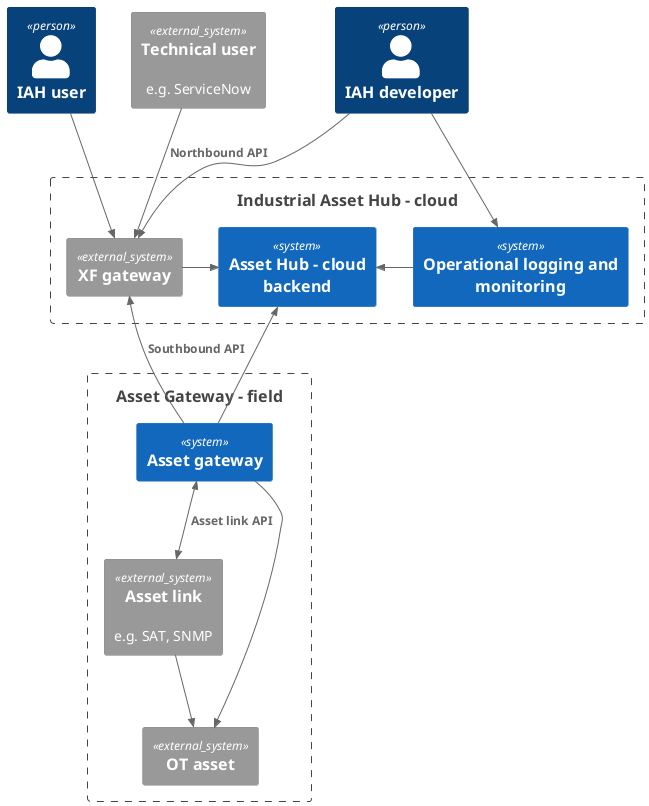

### Components

### Interfaces

| Name           | Responsibility                                                              |
| -------------- | --------------------------------------------------------------------------- |
| Northbound API | REST API to integrate IAH with other third party applications and use cases |
| Southbound API | REST API to integrate custom gateways to interact with IAH                  |
| Asset link API | Protobuf API to integrate Asset links with the Asset Gateway                |

## Level 2

### XF gateway

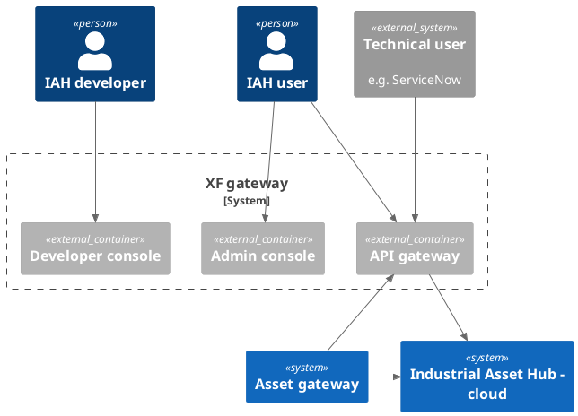

### Asset Hub - Cloud Backend

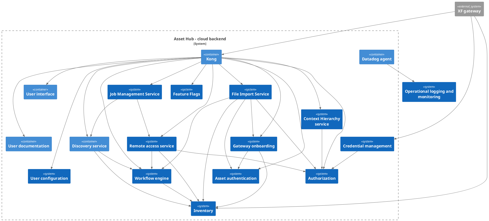

### Asset gateway

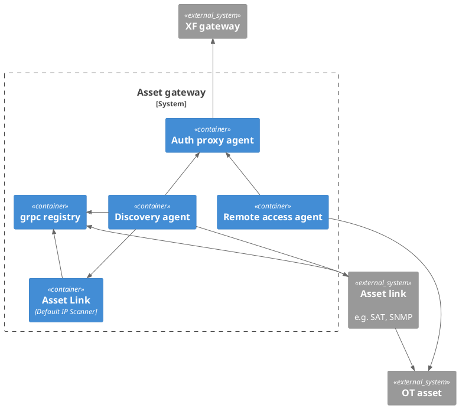

## Level 3

### Inventory

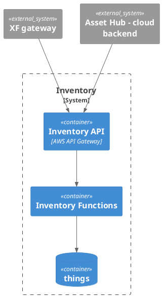

**Purpose/Responsibility:**

- provide API to manage asset descriptions
- deduplication check for each new asset to find existing occurrences
- provide API to manage custom properties and its values

**Quality-/Performance characteristics:**

- handle at least 20 tenants with each ~3000 assets
- get assets request should respond within 500ms, response can also be limited through pagination

**Fulfilled requirements:**

- tbd.

### Asset authentication

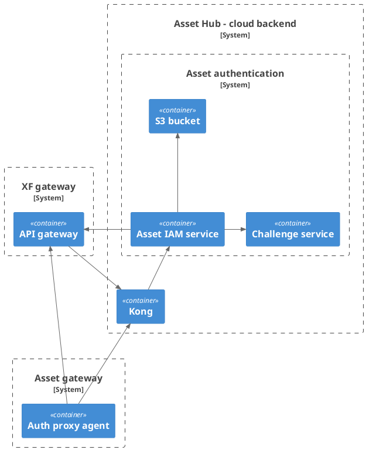

**Purpose/Responsibility:**

- provide API to manage root certificates
- provide API to issue an registration token
- provide API to exchange a valid leaf certificate for a token

**Quality-/Performance characteristics:**

- tbd.

**Fulfilled requirements:**

- tbd.

**Open issues/problems/risks:**

- hand over to XO FDS as contribution
- limit scope of technical user tokens
- (optional) link each asset to an individual server user

### Workflow Engine

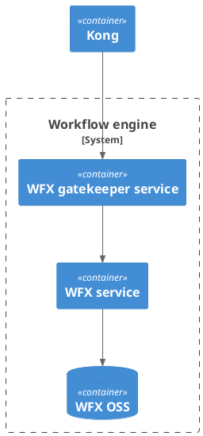

**Purpose/Responsibility:**

- multi-tenant workflow executor
- provide API to manage workflows and jobs

**Quality-/Performance characteristics:**

**Fulfilled requirements:**

- jobs can only be triggered for existing gateway assets

**Open issues/problems/risks:**

- tbd.

### Discovery

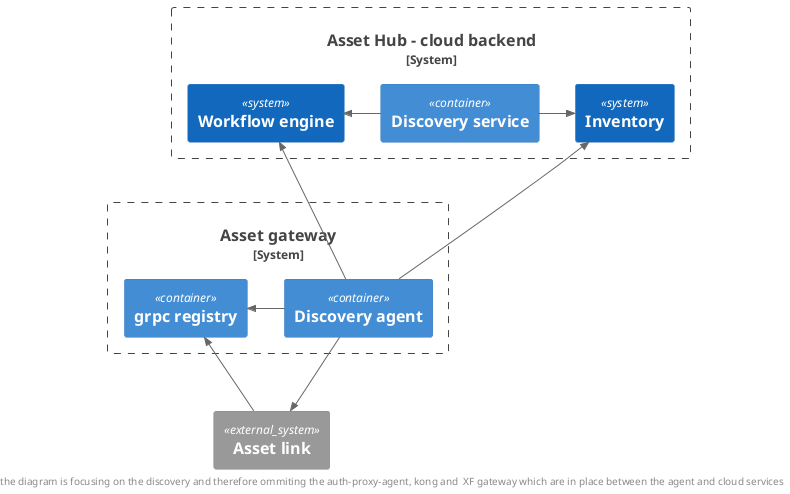

**Purpose/Responsibility:**

- managing discovery jobs according to the defined workflow
- forwarding discovered asset data to inventory

**Interface(s):**

- [Discovery REST API](https://code.siemens.com/common-device-management/discovery/discovery-service/-/blob/main/api/openapi-spec/v1-earlyaccess/discovery.openapi.yaml?ref_type=heads)
- [Discovery Asset Link gRPC API](https://industrial-assets.io/stable/developers/device-builder/specs/iah_discover.proto)

**Quality-/Performance characteristics:**

- tbd.

**directory/file location:**

- [Discovery service](https://code.siemens.com/common-device-management/discovery/discovery-service)
- [Discovery agent](https://code.siemens.com/common-device-management/discovery/discovery-agent)
- [Discovery workflow](https://code.siemens.com/common-device-management/documentation/apis/-/blob/main/workflows/discovery/workflow.json?ref_type=heads)

**Fulfilled requirements:**

- tbd.

**Open issues/problems/risks:**

- tbd.

### Remote Connect

**Documentation:**
<https://code.siemens.com/common-device-management/remote-access/remote-access-service/-/blob/main/README.md?ref_type=heads>

**Purpose/Responsibility:**

- provide API to manage remote connections.
- provides proxy for loading the remote connection based on authentication, authorization.

**Interface(s):**

- [Remote Access service - API](https://code.siemens.com/common-device-management/remote-access/remote-access-service/-/blob/main/api/openapi-spec/v1-earlyaccess/remote-access.openapi.yaml)

**Quality-/Performance characteristics:**

- 1000 concurrent connections across all tenants are supported.
- 100 concurrent connections per gateway are supported.

**Precondition:**

- The asset must have a gateway associated and IP address.

**directory/file location:**

- [Remote Access service](https://code.siemens.com/common-device-management/remote-access/remote-access-service)
- [Remote Access Agent](https://code.siemens.com/common-device-management/remote-access/remote-access-agent)

**Fulfilled requirements:**

- tbd.

**Open issues/problems/risks:**

### Gateway Onboarding

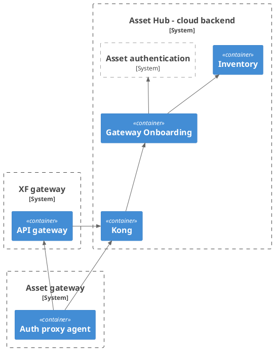

**Purpose/Responsibility:**

- provide API to manage onboarding/offboarding of Asset Gateways

**Interface(s):**

- [Onboarding REST API](https://code.siemens.com/common-device-management/onboarding/onboarding-service/-/blob/main/api/openapi-spec/v1-earlyaccess/gateway-onboarding.openapi.yaml?ref_type=heads)

**directory/file location:**

- [Onboarding service](https://code.siemens.com/common-device-management/onboarding/onboarding-service)

**Open issues/problems/risks:**

- tbd.

### Authorization

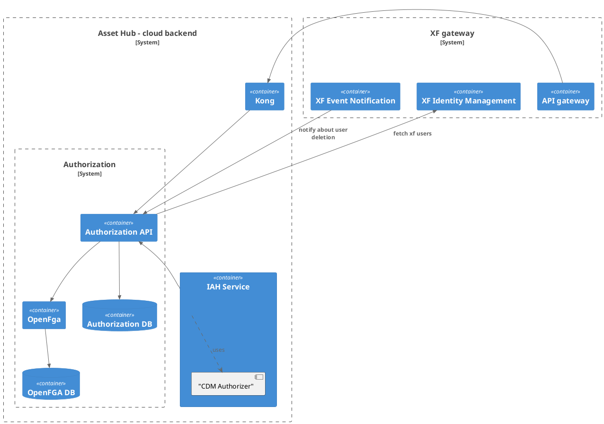

**Purpose/Responsibility:**

- provide API to manage authorization of IAH users

**Interface(s):**

- [Authorization REST API](https://code.siemens.com/common-device-management/iam/authorization-service/-/blob/main/api/openapi-spec/v1/authorization.openapi.yaml)

**directory/file location:**

- [Authorization service](https://code.siemens.com/common-device-management/IAM/authorization-service)
- [OpenFGA](https://code.siemens.com/common-device-management/IAM/openfga)

**Open issues/problems/risks:**

- tbd.

### Feature Flags

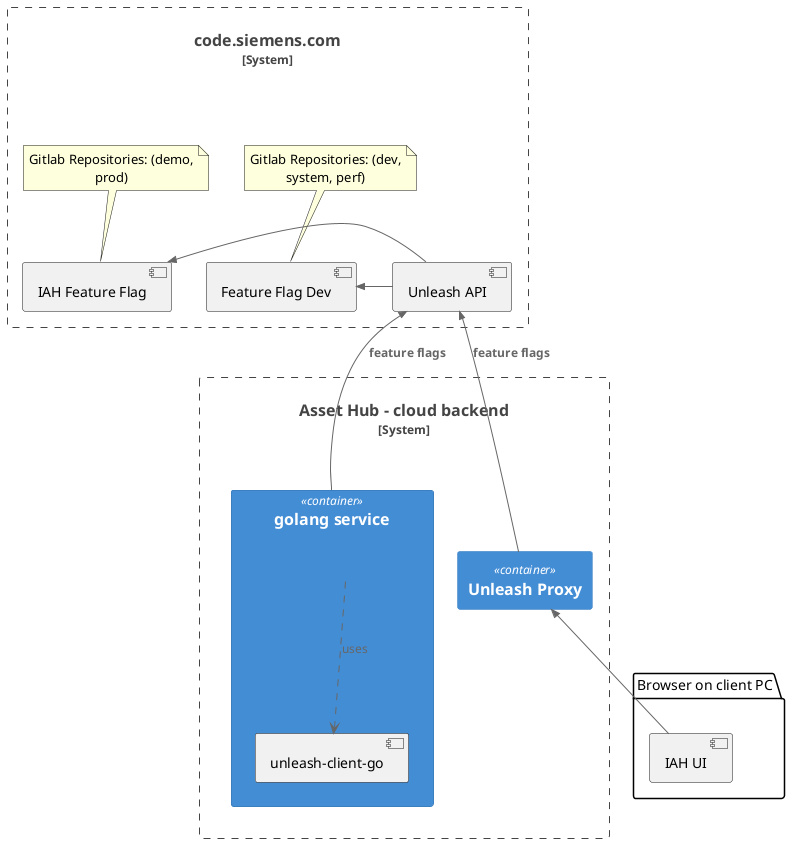

**Purpose/Responsibility:**

- provide functionalities to manage feature flags

**Interface(s):**

**directory/file location:**

**Open issues/problems/risks:**

- tbd.

### Job Management Service

**Documentation:**
<https://code.siemens.com/common-device-management/workflows/job-management-service/-/blob/main/README.md>

**Purpose/Responsibility:**

- Provide API to retrieve all IAH job since a specified date.

**Interface(s):**

- [Job Management Service - API](https://code.siemens.com/common-device-management/workflows/job-management-service/-/blob/main/api/openapi-spec/v1-earlyaccess/job-management.openapi.yaml)

**Quality-/Performance characteristics:**

- TBD

**Precondition:**

- All the services should have harmonized Job Management APIs

**Directory/File location:**

- [Job Management Service](https://code.siemens.com/common-device-management/workflows/job-management-service)

**Fulfilled requirements:**

- TBD

**Open issues/problems/risks:**

- TBD

### Job Scheduling Service

**Documentation:**
<https://code.siemens.com/common-device-management/workflows/job-scheduling-service/-/blob/main/README.md>

**Purpose/Responsibility:**

- Provide APIs to schedule tasks in IAH to be executed at sepcified schedule. APIs are intended to be consumed by other services like discovery service to schedule discovery scans.

**Interface(s):**

- [Job Scheduling Service - API](https://code.siemens.com/common-device-management/workflows/job-scheduling-service/-/blob/main/api/openapi-spec/v1-earlyaccess/job-scheduling.openapi.yaml)

**Quality-/Performance characteristics:**

- TBD

**Precondition:**

- None

**Directory/File location:**

**Fulfilled requirements:**

- TBD

**Open issues/problems/risks:**

- TBD

### Generic IP Scanner

**Purpose/Responsibility:**

- Acts as a default asset link for asset gateway.
- This uses underline nmap for doing a ICMP Ping scan with UDP and MAC Identification.

**Quality-/Performance characteristics:**

- tbd

**Precondition:**

- The IP range should be provided for the scan.

**directory/file location:**

**Fulfilled requirements:**

- tbd.

**Open issues/problems/risks:**

- tbd

### User interface

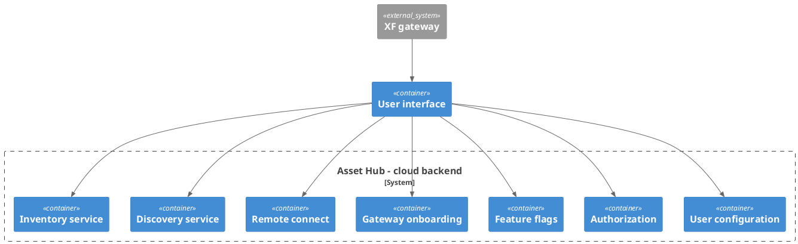

**Purpose/Responsibility:**

- display information collected from cloud backend in user's browser
- CRUD operations for configuration settings per user

**Quality-/Performance characteristics:**

- 3000 assets per list
- maximum respond time 500ms
- maximum memory consumption 500MB

### Credential Management

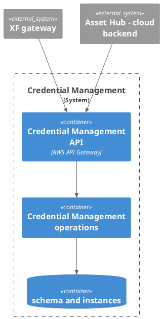

**Purpose/Responsibility:**

- provide API to manage schemas
- provide API to manage instances for the schemas
- maintain assets to instance mapping

**Interface(s):**

**Quality-/Performance characteristics:**

- Credentials stored for 20 tenants 3000 assets
- 1000 credentials can stored for scanning process

**directory/file location:**

**Fulfilled requirements:**

- tbd.

**Open issues/problems/risks:**

### File Import Service

**Purpose/Responsibility:**

- Provide APIs to import excel template file with asset data in IAH.
- Providee APIs to manage file import jobs.

**Interface(s):**

**Quality-/Performance characteristics:**

- TBD

**Precondition:**

- None

**Directory/File location:**

**Fulfilled requirements:**

- TBD

**Open issues/problems/risks:**

- TBD

### Context Hierarchy Service

**Documentation:**

**Purpose/Responsibility:**

- provide API to manage user context based hierarchies.

**Interface(s):**

**Quality-/Performance characteristics:**

- 10 context based hierarchies are supported per tenant.
- 1000 nodes per hierarchy is supported.

**directory/file location:**

**Fulfilled requirements:**

- tbd.

**Open issues/problems/risks:**

- tbd.
