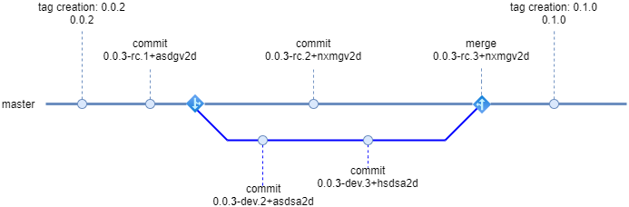
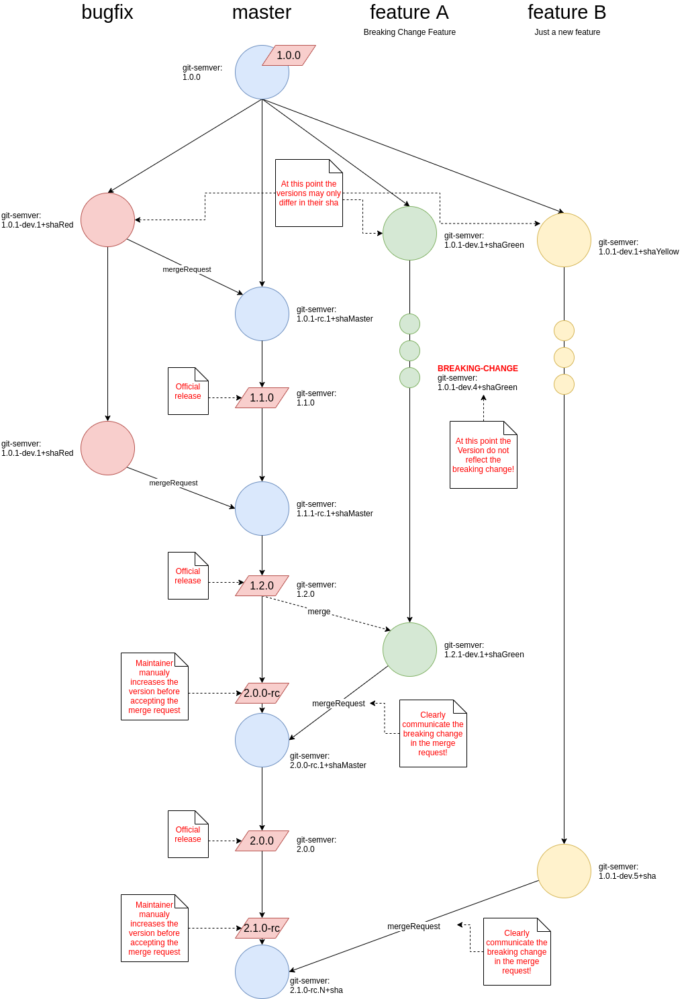
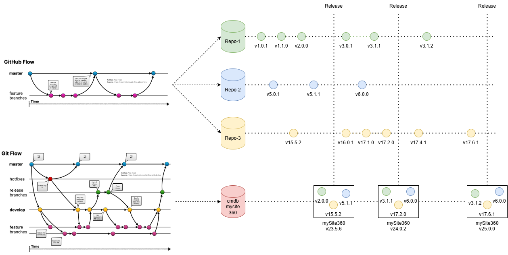

# MySite360 Versioning concept

This documents will summaries the used versioning schema of MySite360.

The concept is based on [Semantic Versioning 2.0.0](https://semver.org/) and the specifics of the different packaging tools like: rpm, war or docker. Further, the git tag mechanisms are used to determine the version of the corresponding service and/or library and enforces the traceability between the artifacts and the source code.

In detail, the versions must contain:

* MAJOR.MINOR.PATCH version number(semversion)
* (optional) a pre-release identifier + git hash for not yet stable versions

Examples:

```sh
1.0.1-dev.3+abcd123
'-.-' '-' | '--.--'
  |    |  |    `---- Short Git hash
  |    |  `--------- Three commits ahead of the previous tag name
  |    `------------ Pre-Release identifier
  `----------------- The name of the base tag
```

This approach paired with [GitHub-Flow](https://docs.github.com/en/get-started/using-github/github-flow) will result in clear straight forward development process and empowers the development teams to define released-, release-candidate- and development- versions for their services/libraries. The basic idea of the [GitHub-Flow-Schema](https://i0.wp.com/build5nines.com/wp-content/uploads/2018/01/GitHub-Flow.png?resize=1600%2C552&ssl=1) enforces the development on feature branches. As soon a stable version has been achieved a merge/pull-request must be open and the changes are directly merged into the master branch. Further, GitLab and GitHub directly supports releasing of software via git tags. This can easily been used in the MySite360 context to mark services/libraries as stable/released.

This will result in the following versions:

* Commit/Merge on branch: `1.0.1-dev.13+abcd123`
* Commit/Merge on master: `1.0.1-rc.3+xyz123`
* Tag on master: `1.0.1`

Sorting example:

```sh
0.2.0 < 1.0.1-dev.13+abcd123 < 1.0.1-rc.3+xyz123 < 1.0.1
```

## Package Manager and Git-Semver

The MySite360 projects uses a wide variety of different package management tools. While all of these tools in general supporting [Semantic Versioning 2.0.0](https://semver.org/) some tools using specific syntax. For example DOCKER do not allow `+` signs while RPM describes pre-release versions via `~` instead of `-`. Further, per default `git describe` does not directly support proper pre-release outputs.

To address these issues, MySite360 uses an adapted version of [git-semver](https://code.siemens.com/idevops/git-semver). This tool allows the easy creation of a MySite360 valid semantic versions and is available in most of the build containers or via curl install.

```sh
curl -kfL curl -fL https://artifactory.int.idevops.de/artifactory/idevops/git-semver/getGitSem.sh | sh
$ ./git-semver
0.0.4-dev.1+59352863
$ ./git-semver -docker
0.0.4-dev.1.59352863
$ ./git-semver -rpm
0.0.4~dev.1+59352863
```

Beside the syntax fix, git-semver will automatically create proper pre-release versions by increasing the patch version for pre-releases. This enables the development, test and deployments teams to use version wildcards and ranges as described here: [Semver Cheatsheet](https://devhints.io/semver).

In detail the tool will produce the following version outputs:



Package management tools will tread the versions in the following order:

```sh
0.0.2 < 0.0.3-dev.2+asdsa2d < 0.0.3-dev.3+hsdsa2d < 0.0.3-rc.1+asdgv2d < 0.0.3-rc.2+nxmgv2d < 0.0.3-rc.3+nxmgv2d < 0.1.0
```

Please notice that `-dev.X` versions are always treaded as lower versions as `-rc.X` versions. Further, most package management tools need a special flag to consider pre-release versions at all.

## Branching Tagging Workflows

This section will illustrate common use-cases and how to do branching and tagging. In general we need to differentiate the following use cases:

* feature development
* bug fixing
* introduction of breaking changes

The following picture describes all these use cases:



As illustrated in the picture a clear communication between the repository maintainer/owner and the developers is necessary. In many cases the decision about a breaking or non-breaking change can only be done after the implementation.

## Special Cases and TODOs

GitLab-CI implementation examples can be found in the [git-semver documentation](https://code.siemens.com/idevops/git-semver#gitlab-ci-usage)

### Docker

Docker does not support the idea of semantic versions. While docker tags can be named in semantic versions style like `0.0.4-dev.1.59352863` docker wont understand the logic behind. The only rule docker is aware of is the `latest` tag. If no other tag is provides via `docker run` or `docker pull` docker defaults to this `latest` tag. In MySite360 we define the following additional rule set:

* 0.0.4-dev.1.59352863 --> development version --> no additional tag
* 0.0.4-rc.1.5152863 --> stable pre-release --> additional `latest` tag
* 0.0.5 --> stable released version --> additional `stable` and `latest` tag

This means the `latest` will always point to the latest commit on master branch or just created tag while `stable` points to the last tagged version.

## MySite360 Version Bundle

The following picture illustrates a MySite360 version bundle. The version bundle is a collection of all versions of the different services and libraries used in the MySite360 project. The version bundle is created by the build process and is used to ensure that all services and libraries are compatible with each other.



## Additional Information

[GitHub Flow](https://githubflow.github.io/)
[Best Branching Strategies](https://www.abtasty.com/blog/git-branching-strategies/)
[Git Flow vs Github Flow](https://www.alexhyett.com/git-flow-github-flow/)
[Alternative](https://blog.programster.org/git-workflows)
