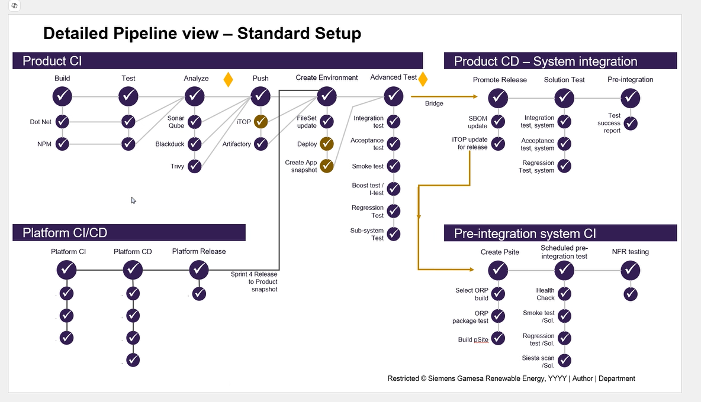
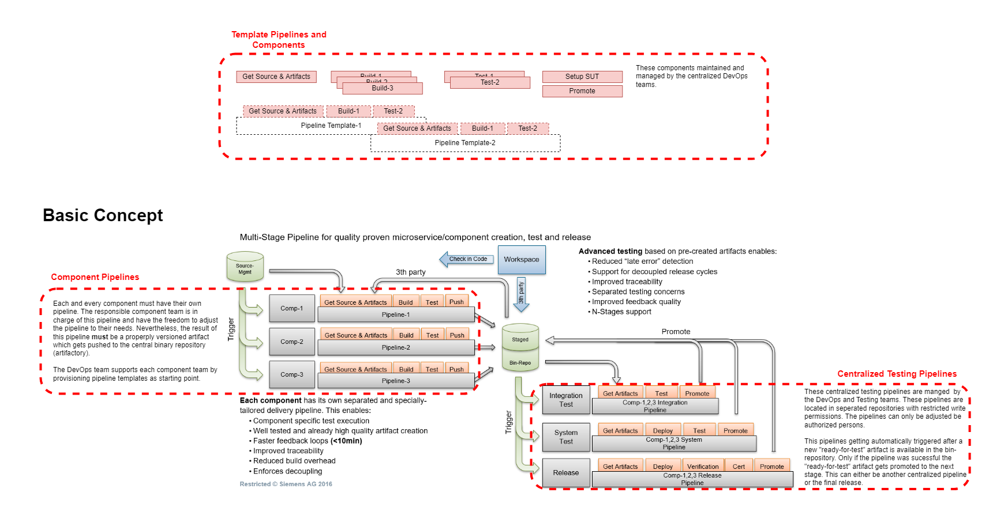

# Devops Architecture Overview

This document provides and high-level overview of the DevOps architecture and most important points to be discussed during the workshop.

The overall Devops Architecture is based on Github as the main repository and CI/CD platform. The architecture includes the following components:

* **Version Control**: GitHub is used for version control, allowing for branching, merging, and collaboration among team members.
* **CI/CD Pipelines**: GitHub Actions are utilized to automate the build, testing, and deployment processes. Pipelines are defined in YAML files within the repository referring to centralized templates.
* **Testing**: Automated tests are integrated into the CI/CD pipelines to ensure code quality and functionality. This includes unit tests, integration tests, and end-to-end tests.
* **Deployment**: The deployment process is automated to AWS using GitHub Actions combined with FluxCD. This includes provisioning infrastructure using Infrastructure as Code (IaC) tools like Terraform and deploying services into Kubernetes clusters.
* **Monitoring and Logging**: Post-deployment, monitoring and logging tools are integrated to track application performance and health.
* **Branching Strategy**: A defined branching strategy is followed, typically including branches such as `main`, `develop`, and feature branches. Pull requests are used for code reviews and merging changes.
* **AWS Integration**: The architecture leverages various AWS services for hosting, storage, and other functionalities. This includes using services like EC2, S3, RDS, and EKS for Kubernetes deployments.
* **Security and Compliance**: Security best practices are implemented throughout the DevOps process, including secret management, vulnerability scanning, and compliance checks.
* **Documentation**: Comprehensive documentation is maintained to ensure that all team members are aware of the processes, tools, and best practices in place.

<!--- #TODO update link -->
The full details of the DevOps architecture can be found in the [DevOps Architecture Documentation](link_to_documentation).

## Tools Used

* Cloud provider: AWS (must use EKS).
* CI platform: GitHub Actions (CI & CD).
* Artifact repo: JFrog Artifactory for container images and artifacts.
* Static code quality: SonarQube (integrated in CI).
* Container orchestration: Kubernetes (EKS).
* IaC: Terraform for AWS infra, Helm for app deployment.
* Versioning: Semantic Versioning (SemVer) with tagging for release based on GitVersion tool.

## Branching and Versions

[GitVersion](https://gitversion.net/) is used to manage versioning based on the branching strategy.

We recommend to go with the GitFlow branching strategy as illustrated [gitflow](https://gitversion.net/docs/learn/branching-strategies/gitflow/examples). This includes the following branches:

* `main`: The main branch contains the production-ready code.
* `develop`: The develop branch is used for ongoing development and integration of features.
* Feature Branches: Feature branches are created from the develop branch for specific features or tasks. Once completed, they are merged back into develop via pull requests.
* Release Branches: When preparing for a release, a release branch is created from develop. This branch is used for final testing and bug fixes before merging into main.
* Hotfix Branches: Hotfix branches are created from main to address critical issues in production. Once fixed, they are merged back into both main and develop.
* Pull Requests: All changes to the codebase are made through pull requests, which are reviewed and approved by team members before merging.
* Versioning: Semantic versioning is recommended for managing versions of the application. This includes using version numbers in the format of MAJOR.MINOR.PATCH.
* Tagging: Releases are tagged in the repository to mark specific versions of the codebase.
